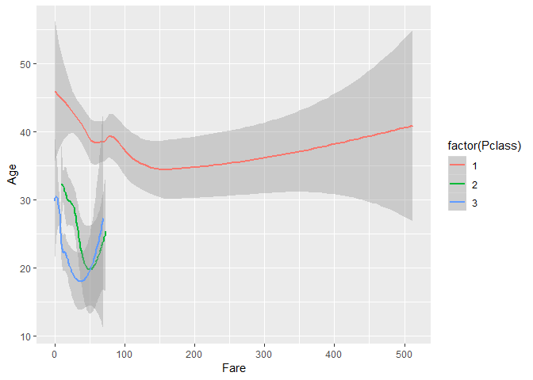
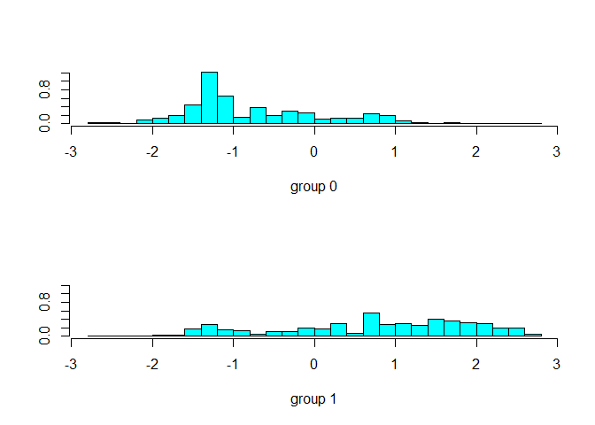

## Applying Machine Learning Techniques on Titanic Data

The analyses here uses the [titanic](https://www.kaggle.com/c/titanic/data) data, available easily of [kaggle](https://www.kaggle.com/). In this analyses, logistic regression, LDA and QDA techniques are used to predict which type of passenger would have survived the tragedy. 

## Loading Libraries


```r
library(MASS)
library(ggplot2)
library(dplyr)
```


## Data exploration and Data Cleaning

In this part, data exploration is carried out and necessary data cleaning steps are performed to make the data ready for predictive modedling.

### Loading the data from the directory

The following code is used to load the data:


```r
train <- read.csv("train.csv")
test <- read.csv("test.csv")

test$Survived <- NA
all <- rbind(train, test)

glimpse(all)
```

```
## Observations: 1,309
## Variables: 12
## $ PassengerId <int> 1, 2, 3, 4, 5, 6, 7, 8, 9, 10, 11, 12, 13, 14, 15,...
## $ Survived    <int> 0, 1, 1, 1, 0, 0, 0, 0, 1, 1, 1, 1, 0, 0, 0, 1, 0,...
## $ Pclass      <int> 3, 1, 3, 1, 3, 3, 1, 3, 3, 2, 3, 1, 3, 3, 3, 2, 3,...
## $ Name        <fct> Braund, Mr. Owen Harris, Cumings, Mrs. John Bradle...
## $ Sex         <fct> male, female, female, female, male, male, male, ma...
## $ Age         <dbl> 22, 38, 26, 35, 35, NA, 54, 2, 27, 14, 4, 58, 20, ...
## $ SibSp       <int> 1, 1, 0, 1, 0, 0, 0, 3, 0, 1, 1, 0, 0, 1, 0, 0, 4,...
## $ Parch       <int> 0, 0, 0, 0, 0, 0, 0, 1, 2, 0, 1, 0, 0, 5, 0, 0, 1,...
## $ Ticket      <fct> A/5 21171, PC 17599, STON/O2. 3101282, 113803, 373...
## $ Fare        <dbl> 7.2500, 71.2833, 7.9250, 53.1000, 8.0500, 8.4583, ...
## $ Cabin       <fct> , C85, , C123, , , E46, , , , G6, C103, , , , , , ...
## $ Embarked    <fct> S, C, S, S, S, Q, S, S, S, C, S, S, S, S, S, S, Q,...
```

```r
colSums(is.na(all))
```

```
## PassengerId    Survived      Pclass        Name         Sex         Age 
##           0         418           0           0           0         263 
##       SibSp       Parch      Ticket        Fare       Cabin    Embarked 
##           0           0           0           1           0           0
```

```r
space <- function (x) {sum(x=="") }
apply(all, 2, space)
```

```
## PassengerId    Survived      Pclass        Name         Sex         Age 
##           0          NA           0           0           0          NA 
##       SibSp       Parch      Ticket        Fare       Cabin    Embarked 
##           0           0           0          NA        1014           2
```

It is observed that `age` is missing for 263 observations. Since, `age` can be one of the important factors to determine the survival of a passenger, it has been imputeted in the next section.

### Predicting missing age
 The missing values of `age` are predicted using `fare` and `Passenger class`.

```r
ggplot(data = all, aes(x = Fare, y = Age, col = factor(Pclass))) +
  geom_smooth()
```

<!-- -->

```r
index <- which(is.na(all$Age))
predict_age <- all[index,]
train_age <- all[-index,]

lm_age <- lm(Age ~ Pclass + Fare + Pclass:Fare, data = train_age)
summary(lm_age)
```

```
## 
## Call:
## lm(formula = Age ~ Pclass + Fare + Pclass:Fare, data = train_age)
## 
## Residuals:
##     Min      1Q  Median      3Q     Max 
## -36.908  -8.117  -1.360   7.775  47.876 
## 
## Coefficients:
##             Estimate Std. Error t value Pr(>|t|)    
## (Intercept) 45.60475    1.56595  29.123  < 2e-16 ***
## Pclass      -5.64937    0.67503  -8.369  < 2e-16 ***
## Fare         0.14181    0.02824   5.021 6.03e-07 ***
## Pclass:Fare -0.15585    0.02583  -6.033 2.23e-09 ***
## ---
## Signif. codes:  0 '***' 0.001 '**' 0.01 '*' 0.05 '.' 0.1 ' ' 1
## 
## Residual standard error: 12.88 on 1041 degrees of freedom
##   (1 observation deleted due to missingness)
## Multiple R-squared:  0.2012,	Adjusted R-squared:  0.1988 
## F-statistic: 87.38 on 3 and 1041 DF,  p-value: < 2.2e-16
```

```r
predict_age$Age <- as.integer(predict(lm_age, newdata = predict_age))

all <- rbind(train_age, predict_age)
colSums(is.na(all))
```

```
## PassengerId    Survived      Pclass        Name         Sex         Age 
##           0         418           0           0           0           0 
##       SibSp       Parch      Ticket        Fare       Cabin    Embarked 
##           0           0           0           1           0           0
```

```r
all$family <- all$SibSp + all$Parch + 1
```


### Splitting the data for predictive modeling

The whole data has been randomly split into training and test. 80% of the data is used as training data to build the model and the rest 20% data is used to test the model built.

```r
#Convert categorical variable to factor type
all$Survived <- as.factor(all$Survived)
all$Pclass <- as.factor(all$Pclass)


index <- which(is.na(all$Survived)) 
train <- all[-index,]
test <- all[index,]

str(all)
```

```
## 'data.frame':	1309 obs. of  13 variables:
##  $ PassengerId: int  1 2 3 4 5 7 8 9 10 11 ...
##  $ Survived   : Factor w/ 2 levels "0","1": 1 2 2 2 1 1 1 2 2 2 ...
##  $ Pclass     : Factor w/ 3 levels "1","2","3": 3 1 3 1 3 1 3 3 2 3 ...
##  $ Name       : Factor w/ 1307 levels "Abbing, Mr. Anthony",..: 109 191 358 277 16 520 629 417 581 732 ...
##  $ Sex        : Factor w/ 2 levels "female","male": 2 1 1 1 2 2 2 1 1 1 ...
##  $ Age        : num  22 38 26 35 35 54 2 27 14 4 ...
##  $ SibSp      : int  1 1 0 1 0 0 3 0 1 1 ...
##  $ Parch      : int  0 0 0 0 0 0 1 2 0 1 ...
##  $ Ticket     : Factor w/ 929 levels "110152","110413",..: 524 597 670 50 473 86 396 345 133 617 ...
##  $ Fare       : num  7.25 71.28 7.92 53.1 8.05 ...
##  $ Cabin      : Factor w/ 187 levels "","A10","A14",..: 1 83 1 57 1 131 1 1 1 147 ...
##  $ Embarked   : Factor w/ 4 levels "","C","Q","S": 4 2 4 4 4 4 4 4 2 4 ...
##  $ family     : num  2 2 1 2 1 1 5 3 2 3 ...
```

```r
index <- sample(1:nrow(train), nrow(train)*0.8)
train_t <- train[index,]
test_t <- train[-index,]
```


## Logistic Regression

### Initial Model

A initial model is built using the important variables observed from the EDA above.


```r
log.fit <- glm(Survived ~ Pclass + Sex + Age + Fare + Embarked + family, family = "binomial", data = train_t)
summary(log.fit)
```

```
## 
## Call:
## glm(formula = Survived ~ Pclass + Sex + Age + Fare + Embarked + 
##     family, family = "binomial", data = train_t)
## 
## Deviance Residuals: 
##     Min       1Q   Median       3Q      Max  
## -2.5944  -0.6340  -0.4339   0.6531   2.5187  
## 
## Coefficients:
##               Estimate Std. Error z value Pr(>|z|)    
## (Intercept)  4.8277316  0.5817426   8.299  < 2e-16 ***
## Pclass2     -0.9810424  0.3389632  -2.894 0.003801 ** 
## Pclass3     -2.4502104  0.3490855  -7.019 2.24e-12 ***
## Sexmale     -2.5323111  0.2187740 -11.575  < 2e-16 ***
## Age         -0.0519039  0.0093045  -5.578 2.43e-08 ***
## Fare         0.0003123  0.0026877   0.116 0.907507    
## EmbarkedQ   -0.0499291  0.4037523  -0.124 0.901582    
## EmbarkedS   -0.3746782  0.2672106  -1.402 0.160861    
## family      -0.2665730  0.0779442  -3.420 0.000626 ***
## ---
## Signif. codes:  0 '***' 0.001 '**' 0.01 '*' 0.05 '.' 0.1 ' ' 1
## 
## (Dispersion parameter for binomial family taken to be 1)
## 
##     Null deviance: 950.78  on 711  degrees of freedom
## Residual deviance: 650.64  on 703  degrees of freedom
## AIC: 668.64
## 
## Number of Fisher Scoring iterations: 5
```

### Model with important variables

```r
log.fit2 <- glm(Survived ~ Pclass +Sex + Age + family , family = "binomial", data = train_t)
summary(log.fit2)
```

```
## 
## Call:
## glm(formula = Survived ~ Pclass + Sex + Age + family, family = "binomial", 
##     data = train_t)
## 
## Deviance Residuals: 
##     Min       1Q   Median       3Q      Max  
## -2.6569  -0.6341  -0.4330   0.6569   2.4892  
## 
## Coefficients:
##              Estimate Std. Error z value Pr(>|z|)    
## (Intercept)  4.740950   0.519411   9.128  < 2e-16 ***
## Pclass2     -1.125262   0.293924  -3.828 0.000129 ***
## Pclass3     -2.520836   0.284236  -8.869  < 2e-16 ***
## Sexmale     -2.583339   0.215990 -11.960  < 2e-16 ***
## Age         -0.053445   0.009234  -5.788 7.14e-09 ***
## family      -0.283546   0.074079  -3.828 0.000129 ***
## ---
## Signif. codes:  0 '***' 0.001 '**' 0.01 '*' 0.05 '.' 0.1 ' ' 1
## 
## (Dispersion parameter for binomial family taken to be 1)
## 
##     Null deviance: 950.78  on 711  degrees of freedom
## Residual deviance: 653.20  on 706  degrees of freedom
## AIC: 665.2
## 
## Number of Fisher Scoring iterations: 5
```

### Prediction on the test data

```r
test_t$prob <- predict(log.fit2, newdata = test_t, type = "response")
test_t$pred <- ifelse(test_t$prob > 0.5, 1 , 0)
table(test_t$pred, test_t$Survived)
```

```
##    
##       0   1
##   0 107  18
##   1   6  48
```


## Linear Discriminant Analysis

### LDA Modeling 


```r
lda.model = lda (Survived ~ Pclass + Sex + Age + Parch, data=train_t)
lda.model
```

```
## Call:
## lda(Survived ~ Pclass + Sex + Age + Parch, data = train_t)
## 
## Prior probabilities of groups:
##         0         1 
## 0.6123596 0.3876404 
## 
## Group means:
##     Pclass2   Pclass3   Sexmale      Age     Parch
## 0 0.1651376 0.6788991 0.8325688 29.87844 0.3532110
## 1 0.2644928 0.3659420 0.3333333 27.22344 0.4855072
## 
## Coefficients of linear discriminants:
##                 LD1
## Pclass2 -0.70457510
## Pclass3 -1.69217349
## Sexmale -2.03863510
## Age     -0.03011856
## Parch   -0.19451498
```

```r
plot(lda.model)
```

<!-- -->

### Prediction on the test data

```r
lda_prob <- predict(lda.model, newdata = test_t)
table(Predicted = lda_prob$class, test_t$Survived)
```

```
##          
## Predicted   0   1
##         0 105  19
##         1   8  47
```

## Quadratic Discriminant Analysis

### QDA Modeling 


```r
qda.model <- qda (Survived ~ Pclass + Sex + Age + Parch, data=train_t)
qda.model
```

```
## Call:
## qda(Survived ~ Pclass + Sex + Age + Parch, data = train_t)
## 
## Prior probabilities of groups:
##         0         1 
## 0.6123596 0.3876404 
## 
## Group means:
##     Pclass2   Pclass3   Sexmale      Age     Parch
## 0 0.1651376 0.6788991 0.8325688 29.87844 0.3532110
## 1 0.2644928 0.3659420 0.3333333 27.22344 0.4855072
```


### Prediction on the test data


```r
qda_prob <- predict(qda.model, newdata = test_t)
table(Predicted = qda_prob$class, test_t$Survived)
```

```
##          
## Predicted   0   1
##         0 106  15
##         1   7  51
```

## Conclusion
LDA and QDA work well when class separation and normality assumption holds true in the dataset. If the dataset is not normal then Logistic regression has an edge over LDA and QDA model. Logistic regression does not work properly if the response classes are fully separated from each other. In general, logistic regression is used for binomial classification and in case of multiple response classes, LDA and QDA are more popular
